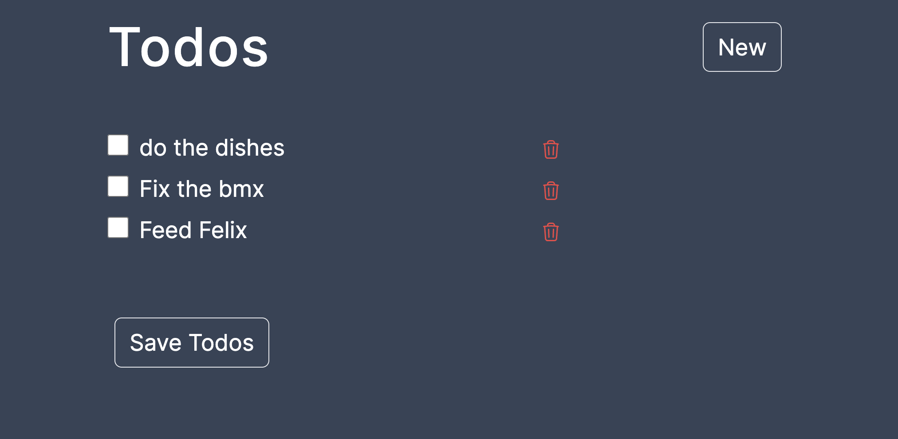

# Todo List With MongoDB
This project is a simple Wishlist application built using Next.js and TypeScript, with MongoDB as the backend database. The application allows users to create, manage, and save their wishlists.

Features
* User-friendly Interface: Intuitive and responsive interface for an enjoyable user experience.
* Todo List Management: Create and delete Todo items.
* Persistent Storage: MongoDB integration for storing wishlist data securely.
* TypeScript: Utilizes TypeScript for enhanced code quality and developer experience.
* Next.js Framework: Developed on the Next.js framework, providing server-side rendering and a powerful React-based structure.
* Scalable and Extensible: Designed for scalability, making it easy to extend the functionality.

## Screenshot

